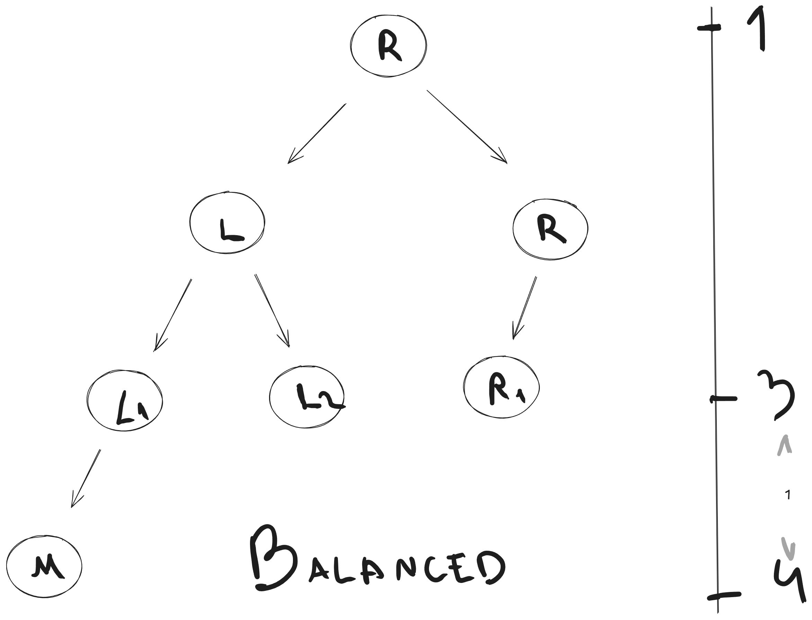
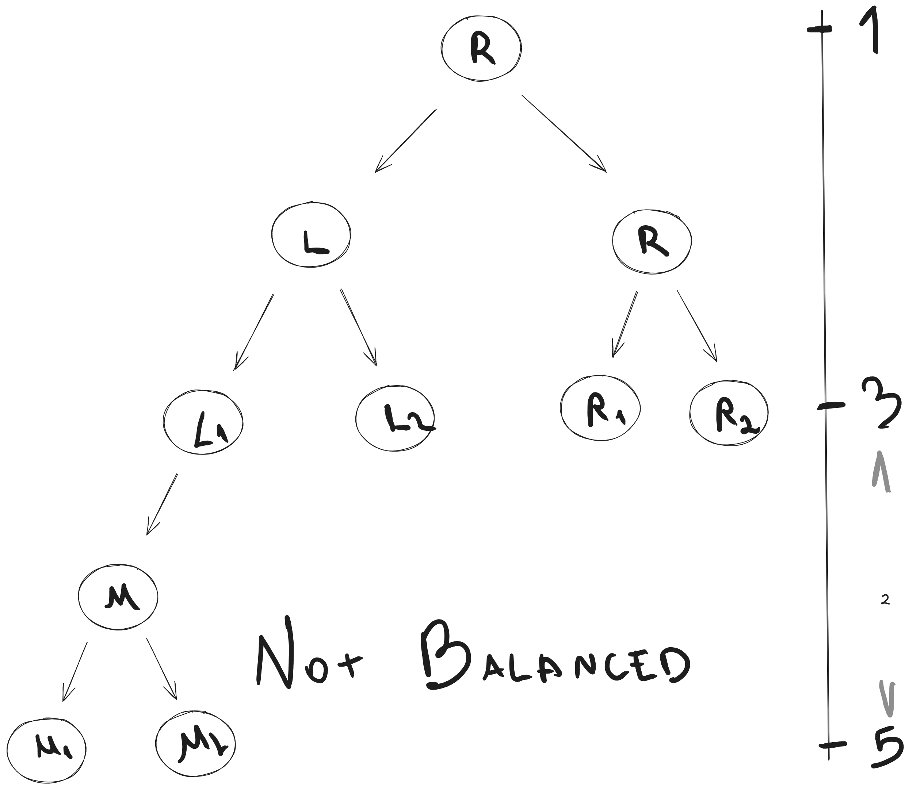

# Binary Tree

The binary tree is a type of tree data structure where each node can have a maximum of two child nodes, a left child and a right child node.

## Binary Tree characteristics

### Balanced

A balanced tree has at most 1 in difference between the height of the left and right subtree, for each node in the tree.

### Complete

A complete binary tree has all levels full of nodes, except the last leveL, where it can be full or filled from left to right. A complete tree it is also balanced.

### Full

A full binary tree has all nodes with 0 or 2 child nodes.

### Perfect

A perfect binary tree has all leaf nodes on the same leve, which it means that all leves are full of nodes and all intern nodes has 2 child nodes. The properties of a perfect binary tree means it is also full, balanced and complete.444