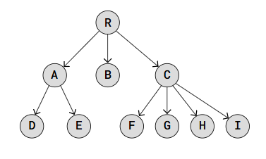

# Tree

Tree is a data structure which where each node can be linked to multiple nodes.
Different from linked lists and derivatives that are linear structures Trees are different, it can have multiple "next" elements, allowing the data structure to branch out in various directions.

## Tree characteristics

- Nodes are each element that compose the treer
- R is the root node
- Edges are the link connecting each node to another
- Leaf nodes/external nodes are nodes who doesn't has children
- Parent node/internal node is a node that has one or multiple children
- The tree height is the maximum number of edges from the root to a leaf node
- The tree size is the total ammount of nodes